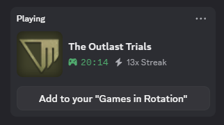
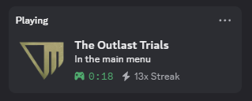
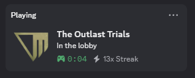
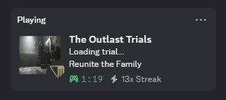
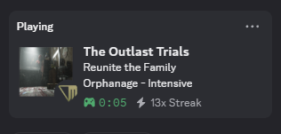
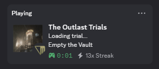
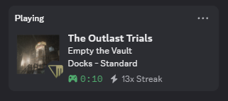

# Better Outlast Presence

Adds Discord Rich Presence for **The Outlast Trials**.

## Purpose

This tool adds in-depth game presence for The Outlast Trials on Discord. This means you can display information about your current game session to other users.

Without the tool, this is always shown:



With the tool:













## What is shown

| Where you are | Discord shows |
| --- | --- |
| Title screen | `At the title screen` |
| Main menu | `In the main menu`, or what you are doing there |
| Sleep room | `In the Sleep Room`, plus your server region |
| Looking for a trial | `Looking for a trial` |
| Loading a trial | `Loading trial...` and the trial name |
| Waiting in the wagon | Trial name, `Waiting for players`, party size |
| Riding to the trial | Trial name, `Heading to the trial`, party size |
| In a trial | Trial name, map, difficulty, party size, time elapsed |

The elapsed counter starts over when the trial proper begins, so it reads the
time you have actually been playing rather than the time since the loading
screen.

During a trial the first line is the trial and the second line the two most
telling of program, difficulty and map, so nothing is ever written twice:

| Trial | Line 1 | Line 2 | Artwork tooltip |
| --- | --- | --- | --- |
| Ordinary program | `Kill The Snitch` | `Police Station - Standard` | `The Outlast Trials - Season 7` |
| Special program | `Silence The Idol` | `Chemical Leak (Part II) - Psychosurgery` | `Television Studio - Season 7` |
| Name not known | `Prison Farm` | `Psychosurgery` | `The Outlast Trials - Season 7` |

The map is the fact that moves to the tooltip when the program needs the
room, since the artwork already shows where you are.

While you are in a menu the presence follows you into the title screen, the
Terminal, the customisation menu, the staff stations, the Invasion pages, the
rewards screen, the news, the tutorials, the season trailer and the Twitch
linking page, and back out again when you close them.

The staff stations (the Director, Prescriptions, Rigs, Amps) all open the
same page and the log never says which one, so they read `With the Murkoff
staff`. The Director is the exception: opening his records, badges, evidence
or newspapers names him, and the presence keeps `With the Director` until
you leave him.

Next to your name Discord writes the game's name. Set `STATUS_DISPLAY` to
`"details"` or `"state"` in `config.py` to put the first or second line of the
presence there instead.

The trial artwork is used as the large image and the Murkoff logo as the small
one. Hovering them shows the trial name, the program, the season, and the
server region with its ping.

## Implementation

Because the game developers didn't add Discord rich presence themselves, there is no official API or way to obtain your game session information. So, I decided to look into the Unreal Engine log file that the game constantly outputs to. It has information keywords like, "LoadMap: /Game/Maps/Global/MainMenu" which means the user is in the main menu screen. The tool checks every new line that is added to the log file for these game phases and will update the Discord presence accordingly.

These are the markers it reads. Every one of them was copied out of a real
`OPP.log` from a session in which trials were played; the game rewrites the
log on every launch, so such a log is the only place they can be checked.

| Marker in the log | What it gives |
| --- | --- |
| `LoadMap: /Game/Maps/Global/MainMenu` | in the main menu |
| `Level: /Game/Maps/Lobby/Lobby_Persistent` | in the sleep room |
| `Find match request is searching` | looking for a trial |
| `Level: /Game/Maps/Global/OPP_Persistent` | the trial server is loading |
| `GameStageInfo changed. Program ID: …, Trial ID: …, Program difficulty: …, Stage: …, EffectiveNumberOfPlayers: …` | trial id, program, difficulty, map, player count |
| `GamePhase changed to <Phase> from <Phase>` | how far the trial server has got, see below |
| `Loading screen : hiding` | the trial world is on screen |
| `?Source=ExperimentFail` in the travel URL | how the trial ended |
| `Pushing menu page: <Widget>` / `Popping menu page: <Widget>` | which menu screen is open, and when it closes |
| `Keeping us-east-1 - 26` | server region and ping |
| `matchmaking configuration name is: release-7-0-…` | the season |
| `New Audio Language : Francais` | which language to word the presence in |
| `[local] Player Init Replicated. Player Id = … IsLocallyControlled = Yes` | your in-game name (opt-in) |

The trial server walks through `WaitingForPlayers`, `WaitingForPlayersSitting`,
`LoadingStage`, `Populating`, `WaitingForClientsPopulate`, `StageReady` and
finally `StageStarted`. The first two are the wagon while players load in and
sit down, the middle four are the ride during which the stage is generated,
and only `StageStarted` is the trial itself. A phase the tool has never seen is
printed once and otherwise ignored, so a game update cannot break the presence,
only leave it on its previous wording.

The map is read from the `Stage:` field rather than guessed from the trial id,
so a trial the tool has no name for still shows where it takes place. The
older id-prefix table is kept as a fallback for logs that lack the field.

Running with `--verbose` during a trial prints every matched line, which is
the quickest way to see what a new build changed.

If you launch the tool while you are already playing, it replays the existing
log to work out where you are, then anchors the log's own clock to the file's
modification time so the "elapsed" counter is right even mid-trial.

## Data accuracy

The trial table is only as good as its source, so here is exactly what has
been checked and against what.

| Data | Checked against | Result |
| --- | --- | --- |
| Server regions | `Saved/Config/WindowsClient/LastGameSessionDetails.ini` and the ping lines in the log | confirmed |
| 47 trial ids | `Saved/SaveGames/Profile-*.sav` | confirmed to exist |
| 7 further trial ids | the same save, and `PF_Trial` live in the log | **exist, name unknown** |
| Difficulty ids | `EProgramDifficulty::` values in the save and `Program difficulty:` in the log | confirmed |
| Program ids | `programCore*`, `programINVASION`, `programCREATOR`, … in the save | exist; only three are worded |
| Log markers | three captured `OPP.log` files, two trials played | confirmed |
| Trial phases | `GamePhase changed to …` in the same logs | confirmed up to `StageStarted` |
| Trial outcome | `Source=ExperimentFail` in the same logs | only the failure has been seen |
| Trial display names | nothing local has them | **unverified** |

The display names cannot be checked offline: they live in the localisation
data inside `OPP-WindowsClient.pak`, which is encrypted, and the save file
stores ids only. They are kept exactly as they were first transcribed rather
than being tidied up, because a plausible-looking correction is still a guess.

Run the audit to see what is still doubtful:

```bash
python main.py --check
```

It lists trials whose map cannot be resolved, ids that exist but have no name,
and names that look hand-typed (a capitalised "The" mid-sentence, a lower case
final word) so you can settle them against the game. It exits non-zero only
for real problems, so it works in a pre-commit hook.

The parser itself is covered by `test_presence.py`, which replays a scrubbed
session through it and checks each phase, the nested menu pages, the local
player's name, the statistics, and that no identifier ever reaches a payload:

```bash
python -m unittest
```

Trial ids seen in your log that could not be named are appended to
`unknown_trials.txt`, since you are usually mid-trial and will never see the
console message.

## Privacy

The log also contains your Steam ID, your Murkoff profile and session IDs, the
game server's IP address and the Steam IDs of your friends. **None of that is
ever put in the presence**, and there is a test that fails if any of it ever
shows up in a payload.

Your in-game name is the one piece of identity the tool can show, and it is
off by default. Turn it on with `SHOW_PLAYER_NAME = True` in `config.py`. It
is read from the line that marks your own player as locally controlled, never
from the sleep room lines, which name the other players' rooms as well.

## How to use

```
pip install -r requirements.txt
```

Then run `run.bat` (or `python main.py`) and it will detect when your game is
open. It needs to keep running in the background while you play. Discord and
the game can be started in any order, and either one can be restarted without
restarting the tool.

### Command line

| Flag | Effect |
| --- | --- |
| `--dry-run` | Print what would be published without contacting Discord |
| `--stats` | Print your play statistics and exit |
| `--check` | Audit the trial and language tables, then exit |
| `--no-stats` | Do not record statistics this run |
| `--language CODE` | Force `en` or `fr` instead of following the game |
| `--log-path PATH` | Read a different log file |
| `-v`, `--verbose` | Also print every log line that was matched |

`--dry-run` is the quickest way to check the tool works:

```bash
python main.py --dry-run
```

## Statistics

Every trial you play while the tool is running is counted into `stats.json`
next to the script: how many trials, how long you spent in them, your longest
one, how they ended (completed, failed, or left early), and which map and
trial you play most. A summary is printed when you stop the tool, and
`--stats` prints it at any time. Turn it off with `TRACK_STATS = False`.

Only the trial itself counts, from the moment the doors open; the wagon ride
does not. Only trials watched live are counted, so restarting the tool never
counts the same trial twice.

## Configuration

Everything adjustable lives in `config.py`:

| Setting | Default | Effect |
| --- | --- | --- |
| `STATUS_DISPLAY` | `"name"` | What Discord writes next to your name: the game, the `details` line or the `state` line |
| `SHOW_ELAPSED_TIME` | `True` | The `XX:XX elapsed` counter |
| `SHOW_PARTY_SIZE` | `True` | `(2 of 4)` during a trial |
| `SHOW_REGION` | `True` | Server region and ping |
| `SHOW_SEASON` | `True` | `Season 7` in the image tooltip |
| `SHOW_PROGRAM` | `True` | `Invasion` or `Trial Maker` after the difficulty |
| `SHOW_MENU_ACTIVITY` | `True` | Which menu screen you are on |
| `SHOW_PLAYER_NAME` | `False` | Your in-game name |
| `LANGUAGE` | `"auto"` | `auto` follows the game, or force a code |
| `TEXT_OVERRIDES` | `{}` | Reword any single line |
| `BUTTONS` | `None` | Up to two link buttons under the presence |
| `TRACK_STATS` | `True` | Record play statistics |
| `LOG_PATH` | `%LOCALAPPDATA%\OPP\Saved\Logs\OPP.log` | Where the game log lives |
| `LOG_POLL_INTERVAL` | `1.0` | How quickly a phase change is picked up |
| `LOG_POLL_MAX_INTERVAL` | `3.0` | Slowest poll, used only while the log is silent |
| `VERBOSE` | `False` | Print every log line that was matched |

To reword a single line without touching `strings.py`:

```python
TEXT_OVERRIDES = {"lobby": "Chilling in the Sleep Room"}
```

## Files

| File | Role |
| --- | --- |
| `main.py` | Watches the log file, drives the loop, handles the command line |
| `GameInfo.py` | Turns log lines into the state shown on Discord |
| `presence.py` | Talks to Discord, with throttling and reconnection |
| `game_constants.py` | Trial names, maps, difficulties, log markers |
| `check.py` | The `--check` audit of the data tables |
| `test_presence.py` | Replays a scrubbed session and checks every payload |
| `strings.py` | Presence wording, per language |
| `stats.py` | Play statistics kept between runs |
| `config.py` | Everything you might want to tweak |

## Adding a missing trial

If a trial is missing, the tool keeps working and prints:

```
Unknown trial id 'XX_MT01' - add it to game_constants.py
```

Add the id to `trial_names` in `game_constants.py` (they can be found from
fmodel under `OPP/Content/Text/Program_Trials.json`), and upload an asset with
the same id in lowercase to the Discord application to get its artwork. If the
id was listed in `known_trial_ids`, remove it from there at the same time.

Seven ids are in `known_trial_ids` today: the game ships them and your save
file proves it, but their wording is not known. Until someone fills them in
the presence shows the map and difficulty instead of a name, which is why a
trial can read "Prison Farm - Psychosurgery" with no title.

The same goes for programs: `programs` in `game_constants.py` words the ones
that are known, and any other id is shown by its suffix (`WMirror`) until
someone reads its name off the screen.

## Adding a language

Copy the `"en"` block in `strings.py`, translate the values, and key it by the
language code the game logs. If the game names it differently in
`New Audio Language : …`, add that name to `AUDIO_LANGUAGES` so it maps to
your code.
